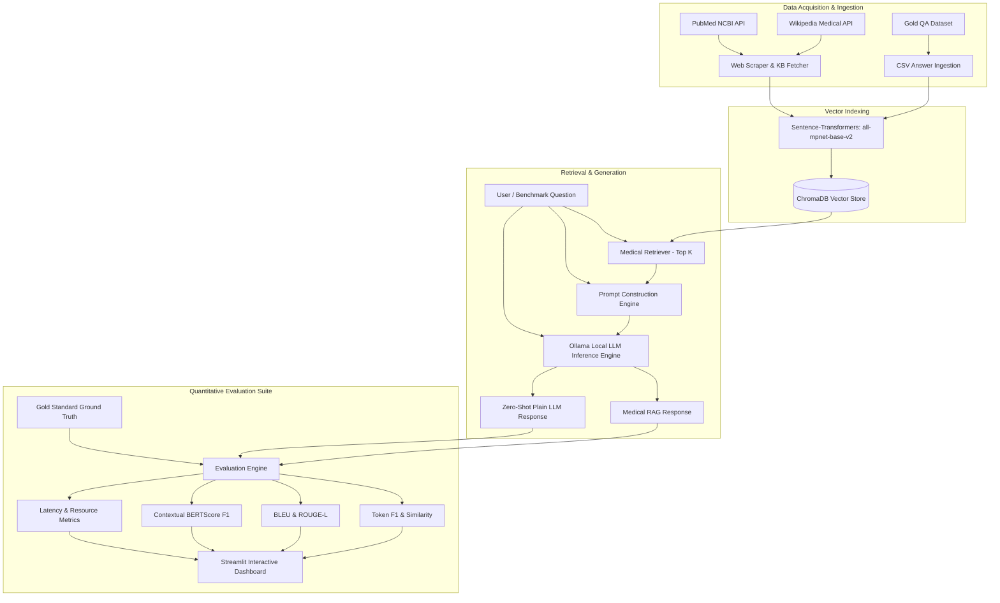

# Clinical RAG vs. Fine-Tuned Small LLMs: Evaluation & Benchmark System

> **MSc Computer Science / Data Science Research Project**  
> *A Quantitative Benchmark Framework for Evaluating Retrieval-Augmented Generation against Zero-Shot Small Language Models in Clinical Question Answering.*

---

## 📌 Executive Summary & Abstract

This repository contains the complete implementation and evaluation benchmark suite for an MSc dissertation investigating **Retrieval-Augmented Generation (RAG)** versus **zero-shot Small Language Models (LLMs)** in the medical domain.

The framework provides an end-to-end clinical question-answering architecture that ingests medical literature (PubMed abstracts, Wikipedia medical articles, and gold QA datasets), indexes vector embeddings in **ChromaDB**, retrieves context using **Sentence Transformers (`all-mpnet-base-v2`)**, and generates patient education style responses using local LLMs (**Llama 3.1 8B**, **MedGemma 1.5 4B**, and **Gemma 3 12B**).

The benchmark pipeline evaluates model outputs against curated clinical gold standard datasets using six standardized NLP metrics: **Token F1**, **String Similarity**, **BLEU**, **ROUGE-L**, **BERTScore (RoBERTa-base)**, and **Inference Latency**.

---

## 🏗️ System Architecture



---

## ✨ Key System Features

- **Interactive Streamlit Web Dashboard (`app.py`)**:
  - **Clinical Query Tab**: Direct comparison of RAG-prompted answers vs. Zero-Shot Plain LLM outputs with side-by-side expandable retrieved sources.
  - **Knowledge Base Tab**: Dynamic scraping and indexing of 10 clinical focus areas (Breast Cancer, Prostate Cancer, Stroke, Diabetes, Alzheimer's, Heart Failure, Skin Cancer, Hypertension, Asthma, Depression).
  - **Benchmark & Analytics Tab**: Automated execution of 50-question fixed benchmark evaluation sets with real-time score visualization and CSV export.
- **Advanced Document Chunking**: Supports structure-aware paragraph chunking with configurable minimum/maximum boundaries and overlap to preserve clinical semantic context.
- **Multi-Source Scraping Engine**: Automated ingestion via NCBI E-utilities (PubMed XML abstracts) and MediaWiki API.
- **Standardized Benchmark Metrics**:
  - **Token F1**: Overlap measurement between prediction and gold standard tokens.
  - **String Similarity**: SequenceMatcher / Levenshtein alignment ratio.
  - **BLEU**: n-gram precision score with smoothing.
  - **ROUGE-L**: Longest Common Subsequence F1 score.
  - **BERTScore**: Semantic embedding similarity using `roberta-base`.
  - **Latency**: Sub-second timing for total generation and retrieval overhead.

---

## 📁 Repository Directory Hierarchy

```
.
├── app.py                      # Main Streamlit Dashboard web application
├── requirements.txt            # Python dependencies specification
├── .env.example                # Environment variable configuration template
├── .gitignore                  # Git repository exclusion file
├── configs/
│   └── rag_config.yaml         # Central pipeline configuration (models, chunk size, top_k)
├── rag/                        # Core RAG Library Modules
│   ├── __init__.py
│   ├── rag_pipeline.py         # Main orchestrator class (MedicalRAGPipeline)
│   ├── document_loader.py      # CSV & scraped KB document chunker & loader
│   ├── embedder.py             # MedicalEmbedder wrapper for Sentence-Transformers
│   ├── vector_store.py         # MedicalVectorStore wrapper for ChromaDB
│   ├── retriever.py            # MedicalRetriever vector search handler
│   ├── benchmark.py            # Comprehensive evaluation pipeline & metric computers
│   ├── bert_scorer.py          # RoBERTa-base BERTScore computer with memory cleanup
│   ├── web_scraper.py          # PubMed & Wikipedia medical API fetchers
│   └── memory_utils.py         # PyCache cleanup and GPU/VRAM memory release helpers
├── scripts/
│   ├── fetch_medical_kb.py     # CLI script to scrape & build 10 focus area knowledge bases
│   └── generate_benchmark_guide.py
├── data/
│   ├── gold_data.csv           # Reference medical QA gold standard dataset
│   ├── benchmark_50_fixed.csv  # Fixed 50-question benchmark evaluation set
│   └── scraped_kb/             # Local markdown storage for scraped PubMed & Wiki articles
├── benchmark_results/          # Auto-saved CSV evaluation benchmark runs
└── test_rag.py                 # RAG pipeline unit test verification script
```

---

## ⚡ Quick Start & Installation Guide

### 💻 Hardware Requirements

| Component | Minimum Requirement | Recommended | Note |
| :--- | :--- | :--- | :--- |
| **GPU VRAM** | **6 GB** | 8 GB+ VRAM | Required for smooth local LLM inference (4B/8B models via Ollama) and BERTScore evaluation |
| **System RAM (CPU)** | **16 GB** | 32 GB | Needed for handling ChromaDB vector indexing, PyTorch models, and benchmark evaluation |
| **Storage** | **15 GB free space** | 30 GB+ SSD | Required for local Ollama model weights (`llama3.1:8b`, `medgemma1.5:4b`, etc.), HuggingFace cache, and vector store |
| **Processor (CPU)** | 4-Core CPU | 8-Core CPU | For rapid web scraping, chunk processing, and embedding pipeline operations |

### Prerequisites

- **Python 3.10 or higher**
- **Ollama**: Installed and running locally ([https://ollama.com](https://ollama.com))

### 1. Clone the Repository

```bash
git clone <repository_url>
cd <repository_directory>
```

### 2. Set Up Virtual Environment

```bash
python3 -m venv .venv
source .venv/bin/activate
```

### 3. Install Required Dependencies

```bash
pip install --upgrade pip
pip install -r requirements.txt
```

### 4. Configure Environment Variables

Copy the template environment file:

```bash
cp .env.example .env
```

### 5. Pull Required LLM Models via Ollama

Ensure the local Ollama daemon is active (`ollama serve`), then pull the target clinical models:

```bash
ollama pull llama3.1:8b
ollama pull medaibase/medgemma1.5:4b
ollama pull gemma3:12b
```

---

## 🚀 Running the Application & Scripts

### 1. Launch the Streamlit Web Application

```bash
streamlit run app.py
```

Open your browser to `http://localhost:8501`.

### 2. Ingest & Scrape Medical Literature (CLI)

To populate the vector database withPubMed abstracts and Wikipedia medical articles across 10 clinical domains:

```bash
python scripts/fetch_medical_kb.py
```

### 3. Run RAG Unit Tests

To verify pipeline initialization, embedding generation, and retrieval:

```bash
python test_rag.py
```

---

## 📊 Benchmark Evaluation Methodology

The experimental framework compares answers generated by the **Medical RAG System** against zero-shot baseline responses from un-augmented LLMs.

### Experimental Setup & Hyperparameters
- **Embedding Model**: `sentence-transformers/all-mpnet-base-v2`
- **Vector DB**: ChromaDB with Cosine Distance
- **Top-K Retrieval**: 3 relevant document chunks
- **Generation Temperature**: `0.2` (Fixed for reproducibility)
- **BERTScore Model**: `roberta-base`

---

## 🎓 Dissertation Attribution & Submission

- **Project Title**: MSc Dissertation Research Codebase
- **Framework**: Python 3.10+, Streamlit, ChromaDB, LangChain, SentenceTransformers, Ollama.
- **License**: Academic Research Use.

---
